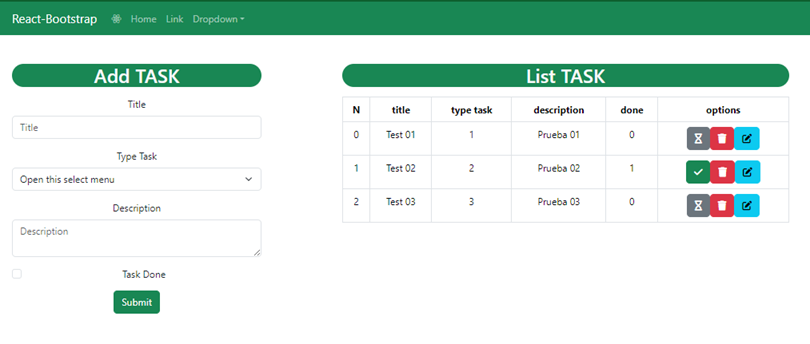
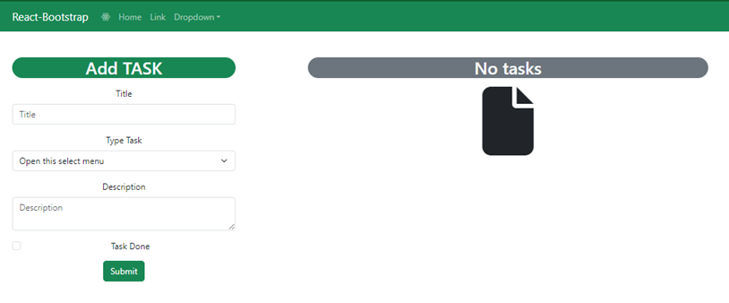
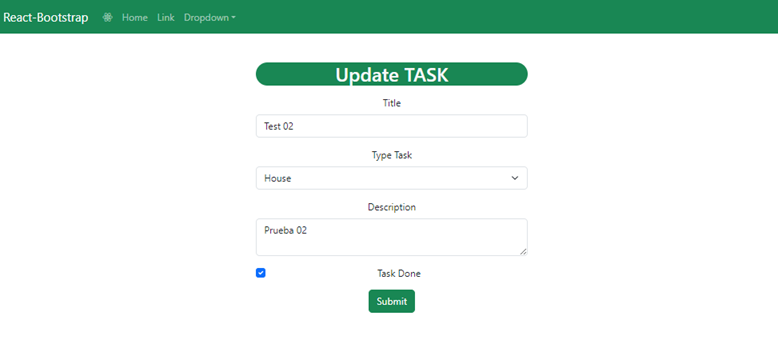

# CRUD REACT and Nest JS

Using:
* Nest.js
* React
* Bootstrap - React
* MySQL
* CDN font-awesome - icons


## Configuration FrontEnd

### Init

* Create Folder:
  ``` bash
  mkdir client
  ```

* cd:
  ``` bash
  cd client
  ```
* Front ( library React )
  ``` bash
  npx create-react-app .
  ```
### Dependencies

* CSS Framework ( Bootstrap and React - Bootstrap )
  ``` bash
  npm install react-bootstrap bootstrap
  ```
* library for HTTP requests in Node.js
  ``` bash
  npm install axios
  ```
*   library that allows you to add routing to a  React web application
    ``` bash
    npm i react-router-dom
    ```

* Applications often run in different environments.
    ``` bash
    npm i --save @nestjs/config
    ```

* Exclude:
  * App.test.js
  * logo.svg
  * setupTest.js

### CDN using
  
* Icons - copy in index.html

  ``` html
  <link rel="stylesheet" href="https://cdnjs.cloudflare.com/ajax/libs/font-awesome/6.5.1/css/all.min.css" integrity="sha512-DTOQO9RWCH3ppGqcWaEA1BIZOC6xxalwEsw9c2QQeAIftl+Vegovlnee1c9QX4TctnWMn13TZye+giMm8e2LwA==" crossorigin="anonymous" referrerpolicy="no-referrer" />
  ```

## Configuration BackEnd

### Init

* Type in "CMD" then "run as administrator" then continue using:
  ``` bash
  npm install @nestjs/cli -g
  ```

* Folder Project
  ``` bash
  cd..
  ```

* Create Folder:
  ``` bash
  nest new server
  ```
  


* Create Module:
  ``` bash
  nest generate module tasks
  ```
* Create Controller:
  ``` bash
  nest generate controller tasks
  ```
* Create Service:
  ``` bash
  nest generate service tasks
  ```


### Dependencies
* Install ORM MySQL:
  ``` bash
  npm install --save @nestjs/typeorm typeorm mysql2
  ```

* Install Transform and Validators:
  ``` bash
  npm i --save class-validator class-transformer
  ```


## Physical Model
The tool `MySQL Workbench` is used to build the physical model, this tool also helps to generate the Script in SQL.

<p align="center">

</p>

Another option is `Enterprise Architect`, it also has similar tools

### Script DB
* [Script](Abstraction/02_Physical_Model/Physical_Model.sql)

  ``` sql
  -- MySQL Script generated by MySQL Workbench
  -- Thu Feb 15 02:34:57 2024
  -- Model: New Model    Version: 1.0
  -- MySQL Workbench Forward Engineering
  
  SET @OLD_UNIQUE_CHECKS=@@UNIQUE_CHECKS, UNIQUE_CHECKS=0;
  SET @OLD_FOREIGN_KEY_CHECKS=@@FOREIGN_KEY_CHECKS, FOREIGN_KEY_CHECKS=0;
  SET @OLD_SQL_MODE=@@SQL_MODE, SQL_MODE='ONLY_FULL_GROUP_BY,STRICT_TRANS_TABLES,NO_ZERO_IN_DATE,NO_ZERO_DATE,ERROR_FOR_DIVISION_BY_ZERO,NO_ENGINE_SUBSTITUTION';
  
  -- -----------------------------------------------------
  -- Schema crud_mysql_dev
  -- -----------------------------------------------------
  DROP SCHEMA IF EXISTS `crud_mysql_dev` ;
  
  -- -----------------------------------------------------
  -- Schema crud_mysql_dev
  -- -----------------------------------------------------
  CREATE SCHEMA IF NOT EXISTS `crud_mysql_dev` DEFAULT CHARACTER SET utf8 ;
  USE `crud_mysql_dev` ;
  
  -- -----------------------------------------------------
  -- Table `crud_mysql_dev`.`type_task`
  -- -----------------------------------------------------
  CREATE TABLE IF NOT EXISTS `crud_mysql_dev`.`type_task` (
  `id` INT(4) UNSIGNED NOT NULL AUTO_INCREMENT,
  `name` VARCHAR(50) NOT NULL DEFAULT '',
  `description` VARCHAR(250) NOT NULL DEFAULT '',
  PRIMARY KEY (`id`),
  UNIQUE INDEX `name_UNIQUE` (`name` ASC) VISIBLE)
  ENGINE = InnoDB;
  
  
  -- -----------------------------------------------------
  -- Table `crud_mysql_dev`.`task`
  -- -----------------------------------------------------
  CREATE TABLE IF NOT EXISTS `crud_mysql_dev`.`task` (
  `id` INT(7) UNSIGNED ZEROFILL NOT NULL AUTO_INCREMENT,
  `type_task_id` INT(4) UNSIGNED NOT NULL,
  `title` VARCHAR(50) NOT NULL DEFAULT '',
  `description` VARCHAR(250) NOT NULL DEFAULT '',
  `done` TINYINT UNSIGNED NOT NULL DEFAULT '0',
  `createdAt` DATETIME NOT NULL DEFAULT CURRENT_TIMESTAMP,
  `updatedAt` DATETIME NOT NULL DEFAULT CURRENT_TIMESTAMP ON UPDATE CURRENT_TIMESTAMP,
  PRIMARY KEY (`id`),
  INDEX `fk_task_type_task_idx` (`type_task_id` ASC) VISIBLE,
  CONSTRAINT `fk_task_type_task`
  FOREIGN KEY (`type_task_id`)
  REFERENCES `crud_mysql_dev`.`type_task` (`id`))
  ENGINE = InnoDB
  AUTO_INCREMENT = 1000000;
  
  
  SET SQL_MODE=@OLD_SQL_MODE;
  SET FOREIGN_KEY_CHECKS=@OLD_FOREIGN_KEY_CHECKS;
  SET UNIQUE_CHECKS=@OLD_UNIQUE_CHECKS;

  ```
#### Example Type Tasks
* [Script_Type_Tasks](Abstraction/02_Physical_Model/Physical_Model_Example_type_tasks.sql)

  ``` sql
  use crud_mysql_dev;
  insert into type_task (name,description) values ('Work','Task from Work');
  insert into type_task (name,description) values ('House','Task from House');
  insert into type_task (name,description) values ('University','Task from University');
  
  use crud_mysql_dev;
  select * from crud_mysql_dev.task;

  ```
## Views
****
#### View Index


****
#### View when there is no task



****
#### Selected and Navbar


****
#### View Update

